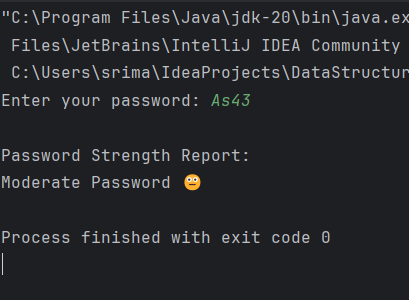
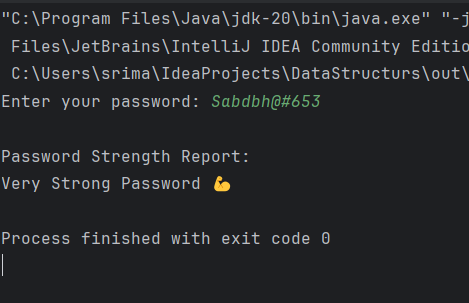

# 🔐 Password Strength Checker

A simple Java program that checks the strength of a password based on various criteria like length, uppercase and lowercase letters, digits, and special characters.  
This project was built as part of a Cognifyz task — *Where Data Meets Intelligence*.

## 🚀 Features

- Checks password strength based on:
  - Minimum length (8 characters)
  - Presence of uppercase letters
  - Presence of lowercase letters
  - Presence of digits
  - Presence of special characters
- Scores password strength as:
  - Very Weak ❌
  - Weak ⚠️
  - Moderate 😐
  - Strong 🙂
  - Very Strong 💪
- Provides user-friendly feedback

## 🛠️ Technologies Used

- Java
- String manipulation
- Regular expressions
- Conditional logic

## 📸 Screenshots

### ✅ Moderate Password Review



### ✅ Strong Password Review



> *(Create a folder named `screenshots` in your repo and add the respective output screenshots)*

## 🧪 How to Run

1. Clone the repository:
   ```bash
   git clone https://github.com/srimabose/password-strength-checker.git
   cd password-strength-checker
